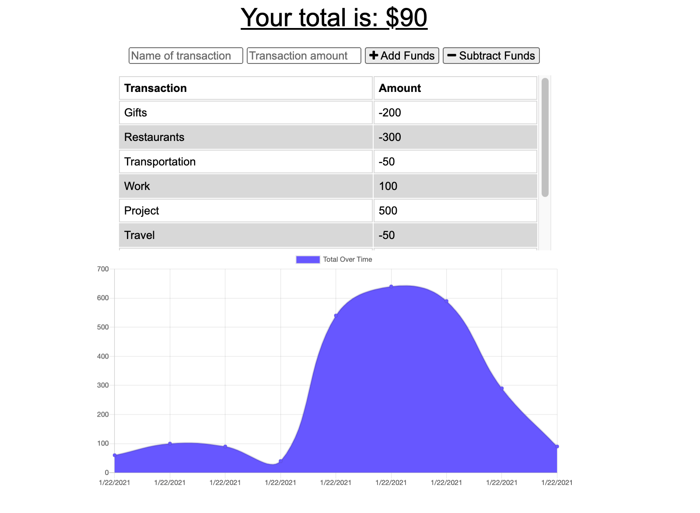

# budget-tracker

## Description :page_with_curl:

This application features budget tracker application that allows offline access and functionality. The user is able to add expenses and deposits to the budget with or without a connection. If the user enters transactions offline, the total is updated when they're brought back online. 

This application is deplpyed to [Heroku.](https://boiling-plains-58611.herokuapp.com/)

## Screenshots :camera_flash:

## Technology Used :label: 

* express
* mongoose
* node
* javascript
* html
* css
* indexDb
* PWA

## Resources Used :wrench: 

* [Express](https://www.npmjs.com/package/express)
* [Mongoose](https://www.npmjs.com/package/mongoose)
* [ASCII Codes Table](https://ascii.cl/)
* [semantic-release](npmjs.com/package/semantic-release)
* [indexDb to build PWA](https://medium.com/jspoint/indexeddb-your-second-step-towards-progressive-web-apps-pwa-dcbcd6cc2076)
* [using service worker](https://developer.mozilla.org/en-US/docs/Web/API/Service_Worker_API/Using_Service_Workers)
* [heroku devcenter](https://devcenter.heroku.com/articles/config-vars)
* [heroku push](https://f-a.nz/dev/update-deploy-to-heroku-app/)
* [emoji-cheat-sheet:for readme](https://github.com/ikatyang/emoji-cheat-sheet)

## Installation :electric_plug:

* run `npm run start` at the root of the directory to connect to the server

## Contribution :heavy_plus_sign: 

Contributions, issues and feature requests are welcome. 
Check out [issues page](https://github.com/MarynaPR/budget-tracker/issues). 
Give :star: if you found this project useful. 

### Questions :question: 
Feel free to contact me with any questions via email :e-mail: pryadkamaryna@gmail.com. 
If you'd like to see my other projects, please visit my :octocat: 
[GitHub](https://github.com/MarynaPR?tab=repositories)